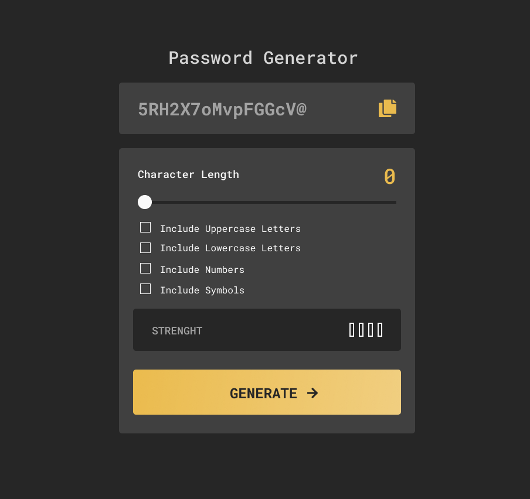

# Password Generator

Small random password generator application, created with the goal of getting my hands dirty with React.

## Table of contents

- [Password Generator](#password-generator)
  - [Table of contents](#table-of-contents)
  - [Overview](#overview)
    - [The Challenge](#the-challenge)
    - [Purpose](#purpose)
  - [My process](#my-process)
    - [Built with](#built-with)
    - [What I learned](#what-i-learned)
  - [Author](#author)

## Overview

### The Challenge

Users must be able to:

- Generate a password based on the selected opt-in options.
- Copy the generated password to the computer clipboard
  View a strength rating for their generated password
- View the optimal layout for the interface based on the screen size of your device
- View scrolling and focus states for all interactive elements on the page

### Purpose

Improve my fundamental front-end development skills, and test new tools and workflows.

## My process

### Built with

- [React](https://es.reactjs.org/docs/getting-started.html) - JS Library
- [Styled-components](https://styled-components.com/docs) - CSS in JS Library
- [Vite](https://vitejs.dev/guide/) - Build tool
- [Netlify](https://docs.netlify.com/?_ga=2.218518233.1576521248.1674676861-529331707.1674502632) - CDN Network

### What I learned

With this project I delved into new workflows, being the first time I worked with Vite as a compiler tool, it was a lot of fun documenting to make all the pieces fit together.

I also had to go back to basics when writing 'clean' CSS inside JS components with styled-components without making use of CSS Frameworks, or component libraries. A challenge to help me refresh and put into practice a lot of the fundamental knowledge.

The key learnings of this project were:

- Setting up a React project with Vite
- Setting up Linting for correct file formatting and best practices
- Structuring React components
- Styling native html input elements such as range and checkboxes
- Collecting data within components
- Devising a good folder/file structure
- Leveraging computed properties to apply conditional styles
- Generate a random string in Javascript
- Using watchers to trigger logic on specific data property updates

## Author

- Twitter: [@oscargjane](https://twitter.com/oscargjane)
- Linkedin: [Oscar Jané](https://www.linkedin.com/in/oscar-jane-frontend-developer/)
